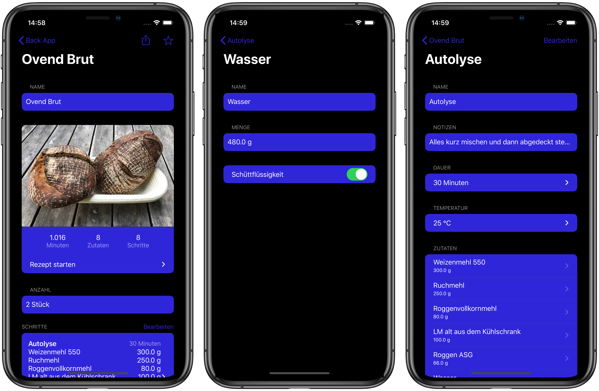

### ### Hi there, I'm Moritz Schaub 👋

## I'm a Student, Programmer, interested in Quantum Engineering, Programming, Tech and baking Bread
- 🔭 I’m currently working on my iOS app that automates bread baking recipes 
- 🌱 I’m currently learning 
- ⚡️ I'm currently studying electrical engineering
- reach out to me: eichenherzmo@mastodon.social

# Curently working on... 
## Baking App
The Baking App is a foss iOS app that automates and enriches your bread baking experience.
It supports the following features:
- amounts and themperatures for all of your ingredients
- exporting your plan with all steps and ingredients
- importing recipes from anywhere
- exporting recipes to share with your friends
- check it out [here](https://github.com/MoSchaub/BrotApp2)

### Screenshots:

